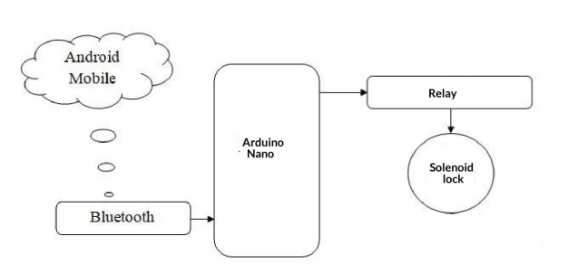
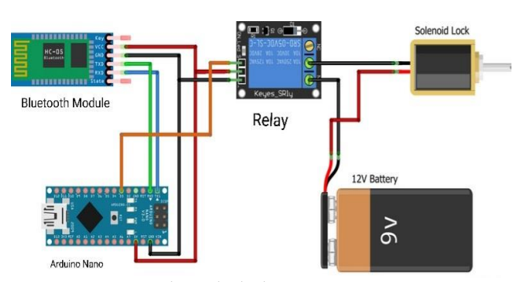
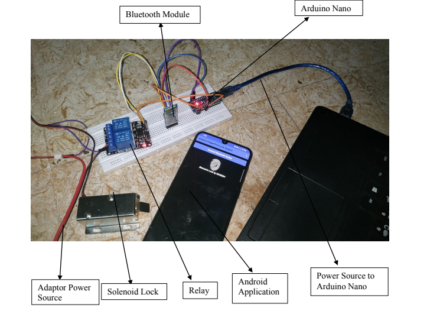
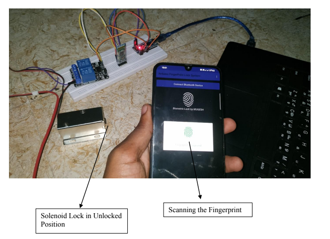

<html>
<body>
    <h1>Smart Door Access System</h1>
    
Created an IoT based door lock system using Arduino. Utilized Block Programming to develop Android application that pairs with Arduino via Bluetooth and fetches authentication to unlock the door.

    <h2>Block Diagram</h2>
    

        

    <h2>Circuit Diagram</h2>
    

        
    

    <h2>Hardware Used</h2>
    <ul>
        <li>Arduino Nano</li>
        <li>HC-05 Bluetooth Module</li>
        <li>Relay</li>
        <li>Solenoid Lock</li>
        <li>Battery or Power Source</li>
    </ul>
    <h2>Software Used</h2>
    <ul>
        <a href="https://www.kodular.io/"><li>Kodular Creator (Android Application)</li></a>
        <a href="https://www.arduino.cc/en/software"><li>Arduino IDE</li></a>
    </ul>
    <h2>Hardware Setup</h2>
    

    
    

    <h2>Final Output</h2>
    

    
    

    <h2>Conclusion</h2>
    
Android fingerprint door access system using arduino nano is a efficient way to improvise safety and security in office and house. The implementation of a door access system using Arduino can prevent theft and ensures the safety of properties. Android fingerprint door access system using arduino nano can be used in houses, banks, office. The proposed system overcomes the issues of in the existing systems. Arduino based security systems will bring a whole new level of high security system with a simple new approach. The proposed systems are easy to maintain and has a long life.

    <h2>Contribution</h2>
    

    This project is open source, so anyone can contribute to its development. If you have any ideas for improvements, please feel free to open a <a href="https://github.com/CodeWithMugesh/smartDoorAccessSystem/pulls">pull request</a>

    
Thank you for your contributions!

<body>
</html>

